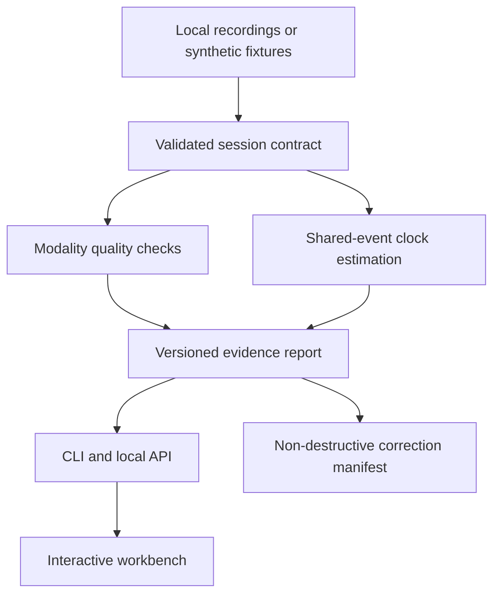

# ModalityOps

**Acquisition reliability for EEG, audio and video.**

Find recording gaps, inspect signal quality, estimate clock offset and drift, and export reproducible corrections—without changing your raw data.

[Quick start](#quick-start) · [Methods](docs/methods.md) · [Import your recordings](docs/data-contract.md) · [Architecture](docs/architecture.md) · [Security](SECURITY.md)

## Why this exists

Three devices can record the same experiment and still disagree about when it happened. ModalityOps makes that disagreement inspectable. It combines an event-anchored clock model, modality-specific quality checks, and a fault-injection laboratory in one local-first workbench.

This is a working **v0.1 research-infrastructure release**, not a clinical device or a validated medical product. Its default examples contain generated signals, not human recordings.

## What you can do

- Inspect EEG, audio and video-derived traces on a linked timeline, with a shared cursor, zoom and flagged intervals.
- Fit a robust affine mapping between independent clocks using shared event IDs; inspect inliers, rejected markers, residuals and drift uncertainty.
- Detect timestamp gaps/repeats/resets, missing values, audio clipping, EEG flatlines, saturation and elevated mains-frequency power.
- Switch between raw time and a correction preview bounded to the observed marker span.
- Open exported reports directly in the browser without uploading them anywhere.
- Run the Python engine locally through the CLI or FastAPI; preserve hashed provenance and atomic report exports.
- Reproduce five synthetic fault scenarios or configure custom offsets, drift and seeds through the local API/UI.
- Import CSV, WAV, MP4/MKV/MOV, and optional MNE-supported EEG formats.

The hosted/static workbench loads **precomputed Python reports**. It does not pretend to run Python in a browser. The full local installation runs fresh analyses and exposes the same UI, including session analysis and run history.

## Quick start

### Full workbench with Docker

```bash
git clone https://github.com/abrar0205/modalityops.git
cd modalityops
docker compose up --build
```

Open **http://localhost:8000**. API documentation is at **http://localhost:8000/docs**. Reports persist in the `modalityops-runs` Docker volume. The service binds to loopback only and requires no API key.

### Python only

Use Python 3.12 for the locked, tested environment. The core package supports Python 3.11+.

```bash
python -m venv .venv
# macOS / Linux:
source .venv/bin/activate
# Windows PowerShell instead:
# .\.venv\Scripts\Activate.ps1
python -m pip install -r requirements.lock
python -m pip install --no-deps -e .
modalityops demo --scenario mixed --out runs/demo
```

Open `runs/demo/report.html`, or import `runs/demo/report.json` into the workbench. The directory also contains the synthetic session, ground truth and correction manifest.

```bash
modalityops demo --scenario clock-drift --offset-ms -250 --drift-ppm 350 --seed 7
modalityops analyze runs/demo/session.json --out runs/reanalysis
modalityops analyze examples/csv-session/manifest.json --manifest --out runs/csv
```

### Full workbench without Docker

After the Python setup, install Node.js 22.13+ and the pnpm version declared in `web/package.json`.

```bash
corepack enable
cd web
pnpm install --frozen-lockfile
pnpm build:static
cd ..
python -m uvicorn modalityops.api:app --host 127.0.0.1 --port 8000
```

On Windows, use the same commands after activating the virtual environment. If Corepack is unavailable, install the declared pnpm version using npm. The UI detects the same-origin API automatically. No separate frontend server or CORS configuration is needed.

## Try the fault laboratory

| Scenario | Injected fault | What the report should show |
|---|---|---|
| `clean` | None | No findings under default thresholds |
| `clock-drift` | EEG +180 ms / +120 ppm; video −90 ms / −72 ppm | Two clock-misalignment findings |
| `dropouts` | 400 ms removed from the video timeline | A visible gap with estimated missing-frame count |
| `signal-quality` | EEG flatline, 50 Hz interference, audio clipping | Three channel-quality findings |
| `mixed` | All of the above | Six evidence-linked findings |

Synthetic reference events are intentionally exact. Near-zero recovery error in these presets demonstrates software correctness, **not real-world synchronization accuracy**. The separate noisy-marker benchmark uses held-out events and one incorrect calibration marker: see [validation](docs/validation.md).

## Data and privacy

- No university datasets, task descriptions, participant media, transcripts or notebook outputs are included.
- CSV/WAV/EEG imports without shared markers remain useful for QC, but cannot establish cross-device synchronization.
- EEG cannot be aligned to arbitrary audio by simply correlating their waveforms. Shared events or a documented clock relationship are required.
- The API stores reports, which contain derived traces and metadata; treat those as sensitive when using real recordings.
- Synthetic data is the default. You supply and authorize any real dataset locally. See [open-data policy](docs/open-data.md).

## Development and validation

```bash
python -m pip install -r requirements-dev.lock
python -m pip install --no-deps -e .
python -m pytest --cov=modalityops --cov-report=term-missing
ruff check src tests scripts
python scripts/export_demo.py
python scripts/benchmark.py
cd web
pnpm test
pnpm typecheck
pnpm build:static
```

The repository includes CI for Python tests, generated media adapters, frontend contracts/type checking, static build and container build. Dependency versions are locked for Python 3.12 and pnpm. Test results measure engineering correctness, not clinical or scientific validity.

## Architecture



## Deliberate boundaries

This release analyzes bounded recording windows in memory. It does not implement streaming acquisition, distributed queues, multi-user authentication, automatic speech-based EEG synchronization, medical interpretation, face recognition, ASR or turn-taking. Video QC uses presentation timestamps and frame luminance; the dashboard is a signal-quality workbench, not a video editor. These boundaries keep the shipped behavior testable and the claims honest.

MIT licensed. Third-party components retain their respective licenses.
